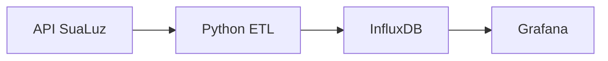

# SuaLuz InfluxDB Importer

Pipeline em Python para extrair telemetria de consumo de energia da plataforma SuaLuz, transformar os registros e armazená-los no InfluxDB para análise e visualização no Grafana.

> Projeto independente e não oficial. A integração depende de uma API interna da plataforma SuaLuz, que pode mudar sem aviso.

## Arquitetura



## O que o projeto faz

- Extrai medições históricas ou do dia atual em intervalos de um minuto.
- Valida datas, respostas HTTP e registros recebidos.
- Normaliza timestamps para UTC respeitando o fuso configurado.
- Converte cada medição em um ponto da série temporal `consumo_energia`.
- Escreve dados em lote no InfluxDB.
- Permite criar dashboards de potência, consumo acumulado e custo estimado.
- Interrompe a execução com uma mensagem clara quando o token da SuaLuz expira.

## Tecnologias

- Python
- Requests
- PyYAML
- InfluxDB Client
- InfluxDB
- Grafana

## Pré-requisitos

- Python 3.9 ou superior
- Conta e medidor acessíveis em `luz.sualuz.com.br`
- Instância do InfluxDB com bucket e token de escrita

## Instalação

```bash
git clone https://github.com/Adrianozk/sualuz-influxdb-importer.git
cd sualuz-influxdb-importer

python -m venv .venv
source .venv/bin/activate
pip install -r requirements.txt
```

No Windows, ative o ambiente virtual com:

```powershell
.venv\Scripts\activate
```

## Configuração

Crie o arquivo de configuração a partir do exemplo:

```bash
cp sualuz_config.example.yaml sualuz_config.yaml
```

Preencha no `sualuz_config.yaml`:

- `sualuz.bearer_token`: token Bearer obtido na sessão web da SuaLuz.
- `sualuz.mac`: identificador do medidor.
- `influxdb.url`: endereço da instância.
- `influxdb.token`: token com permissão de escrita.
- `influxdb.org`: organização do InfluxDB.
- `influxdb.bucket`: bucket de destino.
- `timezone`: fuso local, com padrão `America/Sao_Paulo`.

### Como obter o token da SuaLuz

1. Entre em `luz.sualuz.com.br`.
2. Abra as Ferramentas do Desenvolvedor do navegador.
3. Na aba **Rede**, carregue os dados de consumo.
4. Localize uma requisição para o endpoint de telemetria.
5. Copie somente o valor que aparece depois de `Authorization: Bearer`.

> Nunca publique seu token da SuaLuz ou do InfluxDB. O arquivo `sualuz_config.yaml` deve permanecer fora do controle de versão.

## Uso

Buscar um dia específico:

```bash
python get_sualuz_data.py --start_date 2025-04-28
```

Buscar um intervalo:

```bash
python get_sualuz_data.py --start_date 2025-04-20 --end_date 2025-04-27
```

Usar outro arquivo de configuração:

```bash
python get_sualuz_data.py --start_date 2025-04-28 --config /caminho/config.yaml
```

## Modelo gravado no InfluxDB

- Measurement: `consumo_energia`
- Tags: `fonte` e `mac_medidor`
- Field: `potencia_W`
- Timestamp: UTC

## Ideias de visualização

No Grafana, os dados podem alimentar painéis de:

- potência instantânea;
- consumo por hora ou dia;
- custo estimado;
- comparação entre períodos;
- detecção de picos de consumo.

## Limitações conhecidas

- O token Bearer da SuaLuz expira e precisa ser renovado manualmente.
- Mudanças na API interna podem exigir ajustes no extrator.
- O projeto não possui vínculo com a SuaLuz.

## Autor

Desenvolvido por [Adriano Luís Fernandes](https://github.com/Adrianozk) como parte do seu homelab e dos estudos em Engenharia de Dados, automação e observabilidade.
