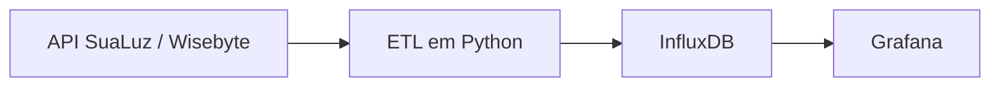

# SuaLuz InfluxDB Importer

Pipeline em Python para extrair telemetria de consumo de energia da plataforma SuaLuz, normalizar os registros e armazená-los no InfluxDB para análise no Grafana.

> Projeto independente e não oficial. A integração usa uma API interna da SuaLuz, que pode mudar sem aviso.

## Arquitetura



## Estado da integração

O importador foi atualizado para o contrato utilizado pelo cliente web da SuaLuz em agosto de 2026.

| Contrato | Requisição | Situação |
|---|---|---|
| Wisebyte atual | `POST /wisebyte-site/prod/api/v0.1.0/item-pt` | Padrão |
| Telemetria legado | `GET /telemetria/api/v1/Telemetria/atual` | Compatibilidade opcional |

Na API atual, o medidor e o intervalo são enviados em JSON e as medições chegam em `response.result_array`, indexadas por timestamp. O código normaliza timestamps locais ou com offset para UTC antes da escrita.

## Recursos

- Consulta um dia ou intervalo de datas.
- Coleta pontos de potência em resolução de um minuto.
- Valida configuração, respostas HTTP e o contrato JSON.
- Converte timestamps para UTC usando o fuso configurado.
- Preserva a leitura do formato legado `{minuto, pt}`.
- Escreve lotes idempotentes no InfluxDB.
- Oferece `--dry-run` para testar API e token sem acessar o banco.
- Possui testes automatizados e integração contínua no GitHub Actions.

## Dashboard Grafana

O repositório inclui um dashboard pronto para visualizar os dados gravados pelo
importador:

O dashboard apresenta:

- potência instantânea ao longo do período selecionado;
- consumo, custo, pico e potência média do dia;
- consumo, custo, pico e potência média do período;
- consumo e custo agregados por dia.

### Importar o dashboard

1. Configure no Grafana uma fonte de dados **InfluxDB 2.x** usando a linguagem
   de consulta **Flux**.
2. Acesse **Dashboards → New → Import**.
3. Envie o arquivo [`grafana/dashboard.json`](grafana/dashboard.json).
4. Selecione a fonte InfluxDB, o bucket e o medidor nos controles do dashboard.
5. Informe a tarifa atual em `Tarifa R$/kWh` para calcular os painéis de custo.

O template espera o mesmo modelo gravado por este importador:
`consumo_energia`, campo `potencia_W` e tag `mac_medidor`. A tarifa é apenas uma
variável do Grafana; alterá-la não modifica os dados armazenados no InfluxDB.

## Tecnologias

- Python 3.9+
- Requests e PyYAML
- InfluxDB Client
- InfluxDB e Grafana
- Pytest e GitHub Actions

## Instalação

```bash
git clone https://github.com/Adrianozk/sualuz-influxdb-importer.git
cd sualuz-influxdb-importer

python -m venv .venv
source .venv/bin/activate
pip install -r requirements.txt
```

No Windows:

```powershell
.venv\Scripts\activate
```

## Configuração

Copie o modelo:

```bash
cp sualuz_config.example.yaml sualuz_config.yaml
```

Preencha `sualuz_config.yaml`:

- `sualuz.mac`: identificador do medidor, normalmente no formato `luz-xxxxxx`;
- `sualuz.bearer_token`: token da sessão web da SuaLuz;
- `influxdb.url`: URL da instância;
- `influxdb.token`: token com permissão de escrita;
- `influxdb.org`: organização;
- `influxdb.bucket`: bucket de destino;
- `timezone`: fuso local usado quando a API retorna timestamp sem offset.

O arquivo real está no `.gitignore`. Nunca publique tokens, respostas brutas ou identificadores pessoais.

### Obter um token atualizado

1. Entre em `https://luz.sualuz.com.br`.
2. Abra as Ferramentas do Desenvolvedor e a aba **Rede**.
3. Acesse **Consumo e Economia → Dia**.
4. Localize a requisição `item-pt`.
5. Em **Cabeçalhos da requisição**, copie apenas o conteúdo depois de `Authorization: Bearer`.

O token expira periodicamente. Um HTTP `401` indica que ele precisa ser renovado.

## Validar a API antes de gravar

O primeiro teste recomendado consulta um dia sem conectar ao InfluxDB:

```bash
python get_sualuz_data.py \
  --start_date 2026-08-31 \
  --dry-run
```

Uma execução válida informa a quantidade e o intervalo UTC dos pontos, sem exibir valores nem salvar a resposta bruta.

## Importar dados

Um dia:

```bash
python get_sualuz_data.py --start_date 2026-08-31
```

Intervalo:

```bash
python get_sualuz_data.py \
  --start_date 2026-08-01 \
  --end_date 2026-08-31
```

Outro arquivo de configuração:

```bash
python get_sualuz_data.py \
  --start_date 2026-08-31 \
  --config /caminho/sualuz_config.yaml
```

## Modelo no InfluxDB

| Tipo | Valor |
|---|---|
| Measurement | `consumo_energia` |
| Tags | `fonte=sualuz`, `mac_medidor=<identificador>` |
| Field | `potencia_W` |
| Timestamp | UTC |

Reexecutar o mesmo período é seguro: no InfluxDB, measurement, tags e timestamp iguais substituem o mesmo ponto em vez de criar uma duplicata lógica.

## Contrato atual da API

Exemplo anonimizado do corpo enviado:

```json
{
  "items": [
    {
      "luz_id": "xxxxxx",
      "initial_date": "2026-08-31 00:00:00",
      "final_date": "2026-08-31 23:59:59",
      "period": "minute",
      "time_wanted": 1
    }
  ]
}
```

O prefixo `luz-` é removido somente no `luz_id` enviado à Wisebyte. A tag `mac_medidor` preserva o identificador configurado, mantendo compatibilidade com séries e dashboards existentes.

## Modo legado

Para uma instalação que ainda responda pelo endpoint antigo:

```yaml
sualuz:
  api_mode: "legacy"
  base_url: "https://apiapp.sualuz.com.br/telemetria/api/v1/Telemetria/atual"
```

## Testes

```bash
pip install -r requirements-dev.txt
pytest -q
```

Os testes cobrem:

- montagem do corpo Wisebyte;
- timestamps locais e ISO 8601 com offset;
- ordenação e conversão da potência;
- resposta legada;
- detecção de mudança no contrato.

## Diagnóstico

| Sintoma | Causa provável | Ação |
|---|---|---|
| HTTP `401` | Token expirado | Obtenha outro token no navegador |
| `response.result_array` ausente | Mudança na resposta | Execute `--dry-run` e revise o contrato |
| Nenhum ponto retornado | Medidor sem dados no período | Teste um dia que possua leitura no site |
| Falha no ping do InfluxDB | URL, rede ou serviço | Verifique a URL e a porta `8086` |
| Erro de escrita | Token, organização ou bucket | Revise as permissões do token do InfluxDB |

## Limitações

- Não existe uma API pública documentada para esta integração.
- O token da SuaLuz expira e precisa ser renovado manualmente.
- A qualidade e a disponibilidade dos pontos dependem do medidor e da plataforma.

## Autor

Desenvolvido por [Adriano Luís Fernandes](https://github.com/Adrianozk) como projeto de Engenharia de Dados, automação e observabilidade no homelab.
